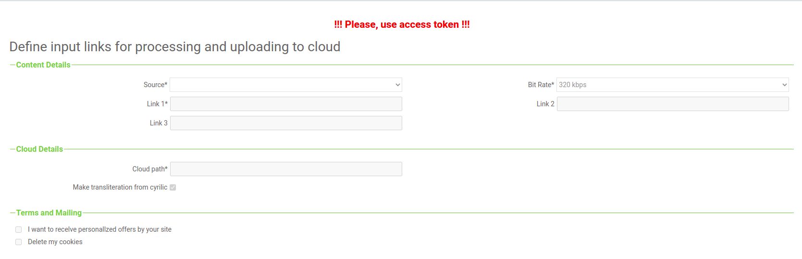
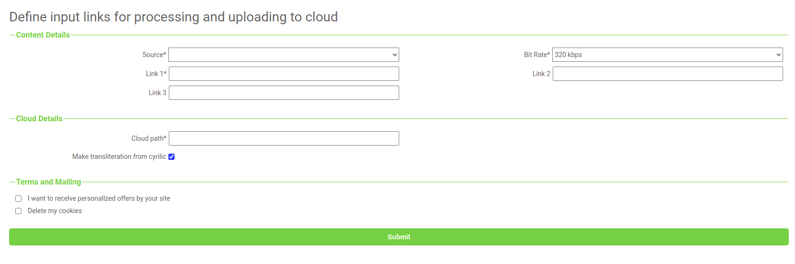

## Simple application based on Flask framework for downloading audio from YouTube

There are also in using next libraries:
- Celery (launching and execution tasks in async mode)
- Redis (the broker for Celery and interchange of state info)
- youtube_dl (the python library for parsing content from YouTube)
- mega.py (the library for working with cloud storage https://mega.nz)

#### For using it just define .env file with necessary credentials for cloud connection and redis 

After that, just try next command in terminal:


```bash
_node: ~/work/youtube_downloader$ docker-compose up --build -d
```

if all correct you can see next in your browser:

<h2 align="center"> ERD<br>

  
</h2>

And after authorization you can see next :

<h2 align="center"> ERD<br>

  
</h2>